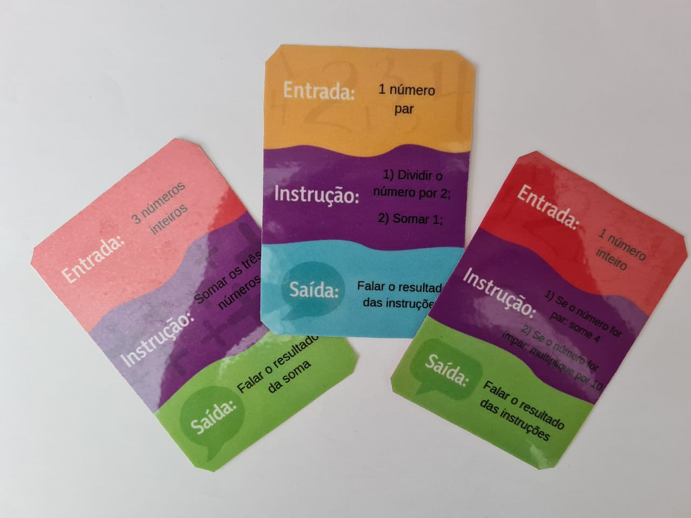
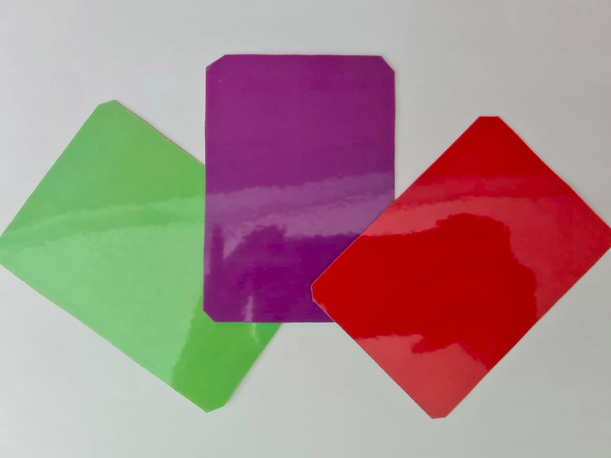
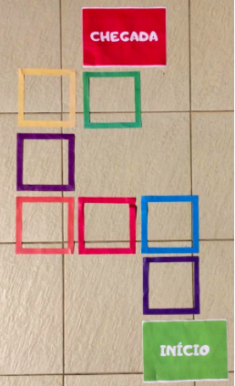

# Coletânea de Jogos de STEM

## Summary
1. [Sobre](#Sobre)
2. [Motivação](#Motivação)
3. [Resumo dos Jogos](#Resumo-dos-Jogos)
4. [ O que você irá encontrar nesse repositório](#O-que-você-irá-encontrar-nesse-repositório)
5. [Links para referência ](#Links-para-referência)
6. [Licenças](#Licenças)

## Sobre
Bem vindo(a)!! Que bom ter você por aqui!

Sou Jéssica e fui professora de robótica por 2 anos para turmas de alunos na faixa etária de 8-13 anos. Durante minha trajetória, fui criando alguns jogos para que pudéssemos trabalhar conceitos importantes de programação e eletrônica. 

Hoje em dia não trabalho mais com educação, mas gostaria de compartilhar os jogos feitos na época caso outros professores (ou pais!) queiram também utilizar, ou adaptá-los. Eles foram feitos com muito carinho e nos deixaram muitos bons momentos em sala!
Um grande abraço e, qualquer dúvida ou comentário, só entrar em contato através do e-mail jliporace@poli.ufrj.br.
Esses jogos estão protegidos por licença em caso de adaptação/uso comercial sem autorização.

## Motivação
"Ensinar não é transferir conhecimento, mas criar as possibilidades para a sua própria produção ou a sua construção." (Paulo Freire, Pedagogia da autonomia) 

### A participação ativa do aluno e a memória afetiva
Sempre ouvi muito sobre a importância da participação ativa do aluno e da interação social no processo de construção de conhecimento. Nos estudos que fiz na época, dois teóricos me saltaram aos olhos: Piaget, que defendia a utilização de atividades iterativas e formulações de hipóteses para resolução de problemas; e Montessori, que já destacava a importância dos ambientes, das vivências e brincadeiras na formação dos alunos. 

Acredito que estes métodos possuam especial importância quando falamos de ensinar *conceitos abstratos*, como os presentes na programação, eletrônica e robótica. Proporcionar que o aluno faça parte de dinâmicas e jogos de maneira ativa permite que ele seja imerso no contexto daquele novo conteúdo. Durante a atividade, ele pensará e precisará tomar decisões lógicas que estarão relacionadas com os novos conceitos e, pouco a pouco, compreenderá melhor como funciona esse novo universo. Além disso, os alunos participam de uma experiência social (com risadas, acordos e desafios) e ficam muito mais atentos, pois precisam entender como o jogo funciona e completar seus objetivos. Todas essas experiências, em um ambiente seguro de sala de aula, contribuem para criação de uma gama de memórias afetivas relacionadas ao conteúdo, que auxiliam muito no processo de aprendizado. 

Como exemplo, no início das nossas aulas de programação, fizemos uma brincadeira muito divertida e criativa, que um pai compartilhou no [YouTube](https://www.youtube.com/watch?v=Ct-lOOUqmyY). Neste dia, levamos pão, queijo e geleia para sala. Os alunos escreviam uma receita de sanduíche e eu deveria tentar montá-lo seguindo literamente as instruções que eles escreveram. Isso significava tentar pegar a geleia sem ter aberto o pote, passar a geleia na mesa porque esqueceram de pegar o pão, e muitas outras ocasiões que deixaram os alunos rindo, se divertindo e, às vezes, brigando comigo! (No final, todos comeram os sanduíches!)

Eles então criam boas memórias dessas brincadeiras, atuando em situações embuídas de conceitos importantes de tecnologia, e essas experiências auxiliam o professor a construir o conhecimento intuitivo necessário para que os alunos compreendam os conceitos mais abstratos e complexos que serão apresentados adiante. Os alunos sempre perguntavam quando poderíamos fazer brincadeiras parecidas, como essas ou como as dos jogos. E sempre que falávamos sobre instruções e comandos em programações, poderíamos voltar a brincadeira: "lembra quando você escreveu a receita do sanduíche?".  

### A experiência social dos jogos/brincadeiras
Uma faceta muito interessante dos jogos é que eles proporcionam a iteração entre os alunos. Além da grande camada de memórias afetivas relacionadas ao conteúdo, o aprendizado social que eles ganham durante esse engajamento é muito benéfico para a turma e a formação de relações.

Os alunos trabalharão em grupo e assim, podem vivenciar uma série de experiências:
- ajudar os colegas do grupo, quando necessário, e a entender seus erros/acertos;
- liderar um grupo e de tentar trazer consenso para o time;
- conseguir se comunicar e ser ouvido, dentre muitas outras.

Quando apresentados a um desafio ou a uma situação de competição, os alunos também poderão trabalhar sua concentração, o controle de ansiedade (para esperar sua vez) e respeitar os erros e dificuldades do próximo - trabalhando para auxiliá-los, ao invés de criticá-los.

Eles vão vivenciar vitórias e também derrotas - e até mesmo os momentos ruins podem ser oportunidades de aprendizado dentro de um ambiente seguro de sala de aula, com o auxílio do professor para ressignificar esses momentos, e do apoio dos colegas para dar suporte a situação. 

Todas essas habilidades e experiências contribuem não só para o aprendizado dos alunos, mas também para a construção de amizades dentro da sala, criando um grupo unido por uma série de vivências. Isso também ajuda no aprendizado ao fazer que os alunos fiquem animados de vir estudar na aula seguinte, e queiram compartilhar o aprendizado com os colegas. 

Imagino que às vezes possa parecer que as brincadeiras são mais úteis para crianças menores do que para aquelas que estão quase entrando na adolescência. Contudo, percebi que a turma inteira ficava muito animada em jogar. Em termos de ajuda aos colegas, os maiores poderiam ganhar muito ao aprender a auxiliar e esinar os menores. Com isso, eles trabalham sua empatia, compreensão, paciência e até mesmo habilidades de ensino. Mas, cá entre nós, mesmo nos pré-adolescentes a gente consegue perceber o sorriso e brilho nos olhos quando eles veem a oportunidade de "voltar a ser criança"!

### TDAH
O pontapé final para a criação dos joguinhos surgiu durante estudos sobre como melhorar a experiências em sala para crianças com TDAH, após saber desta característica de alguns dos meus alunos. Um artigo que me auxiliou bastante foi o escrito por Rosimeire Desidério e Maria Cristina Miyazaki [2], que comentou a importância de atividades que envolvam participação, do respeito aos momentos de atenção da criança, de ter intervalos entre momentos de foco/brincadeira e da consequência positiva de um limite de tempo para cada atividade. Fiquei muito feliz de ver que esses alunos eram muito participativos nesses joguinhos.

Por mais que às vezes eles tivessem momentos de frustração - como todos os outros alunos - até mesmo essa experiência era algo muito interessante de se trabalhar durante as dinâmicas em sala de aula, com o apoio do professor e dos colegas. 

## Resumo dos Jogos

1) Jogo "Adivinhe a Instrução" 

Esse jogo foi criado com o objetivo principal de trabalhar o conceito de entradas, saídas e do fluxo da informação. O objetivo dos alunos é adivinhar a instrução de uma carta (figuras 1 e 2), fornecendo entradas e ouvindo as saídas. O jogo tem três níveis de dificuldade e as 20 cartas que utilizei estão disponíveis na pasta jogo-adivinhe-a-instrucao. Lá, você também encontrará uma descrição mais detalhada de como jogar, dos conteúdos que ele trabalha e da minha experiência com ele! 

  
   

2) Jogo do Compilador

O objetivo deste jogo é introduzir os conceitos de linguagem de programação e compilador para os alunos, facilitando a sua abstração acerca da utilização de comandos e seus significados. Os alunos devem criar a própria linguagem composta por 4 comandos e devem utilizá-la para se mover no tabuleiro. O jogo também trabalha habilidades de organização de ideias, trabalho em equipe, imaginação, raciocínio lógico e lateralidade (para os pequenos!). Uma descrição mais detalhada da dinâmica do jogo assim como uma sugestão de como montar os tabuleiros pode ser encontrada na pasta jogo-do-compilador. 

3) Jogo das Palavras

O objetivo principal deste jogo é que as cartinhas auxiliem os estudantes a assimilar melhor alguns conceitos de eletrônica e programação e também a conseguir formular melhor suas descrições. Ele funciona como um imagem&ação, mas com a descrição dos componentes ao invés dos desenhos! As cartas estão disponíveis na pasta jogo-das-palavras, assim como uma descrição melhor de como jogar!

## O que você irá encontrar nesse repositório

### Impressão dos Jogos
As folhas com as cartas estão disponíveis em arquivos pdfs da seguinte forma: as páginas ímpares são a frente da carta e as páginas pares são o verso, de forma que ao imprimir uma folha seja possível colocar um verso colorido. Isso é importante para os jogos que tenham vários níveis de dificuldade, que são definidos pelas cores. 

Cada página pode conter uma ou mais cartas. Quando eu imprimia para levar em sala, eu normalmente imprimia toda a folha, frente e verso, em papel 90g e plastificava cada folha separadamente.
Depois, cortava as cartas em cada folha. Os resultados ficavam bons e eram relativamente baratos! Elas ficaram assim: 

  
   

### Tabuleiros e materiais extras
Para jogar alguns jogos, nós utilizamos em sala materiais auxiliares, como peões, tabuleiros, dados, personagens, etc. Infelizmente não consigo deixar esses artigos em referência como pdf, mas é muito interessante explorar com os alunos novas maneiras de criar esses materiais! 

Algumas ideias são pedir para cada um trazer um peão próprio, ou os próprios dados, escolher o personagem ou os nomes dos grupos, e pedir para eles mesmos fazerem sugestões para incrementar o jogo. Tudo isso ajuda a fazer eles se sentirem parte do processo - às vezes mudar a temática do jogo para um assunto que a turma goste pode também ser muito interessante.

Uma dessas variantes que usamos, por exemplo, foi no jogo do compilador. Ao invés de trazermos um tabuleiro clássico para os alunos movimentarem os peões, nós montamos um tabuleiro no chão da sala, onde os próprios alunos eram os peões e tinham que se movimentar. (imagem abaixo)

## Links para referência 

1. [TRON - Ensino de Robótica Educativa](https://tron-edu.com/)
2. [Transtorno de Déficit de Atenção / Hiperatividade (TDAH): orientações para a família](https://www.scielo.br/scielo.php?script=sci_arttext&pid=S1413-85572007000100018)

## Licenças
O uso dos jogos é livre para usos acadêmicos e recrativos não comerciais. Fiquem à vontade!! Apenas no caso de alguma publicação científica ou online, eu peço que citem esse repositório como fonte original!

Caso se queira utilizar o projeto ou alguma adaptação de uma maneira comercial, peço que me contactem através do e-mail jliporace@poli.ufrj.br. 
