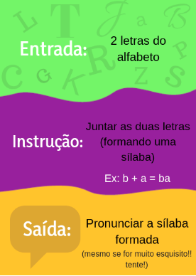
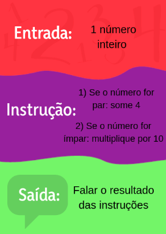
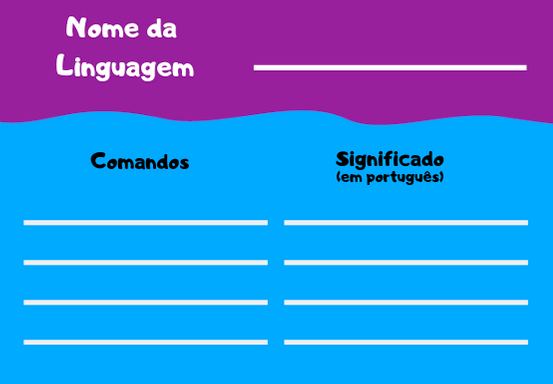
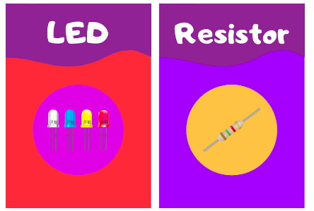

# Coletânea de Jogos de STEM

## Sobre
Bem vindo(a)!! Que bom ter você por aqui!

Sou Jéssica e fui professora de robótica por 2 anos para turmas de (incríveis) alunos na faixa etária de 8-13 anos. Durante minha trajetória, fui criando alguns jogos para que pudéssemos trabalhar conceitos importantes de programação e eletrônica. 

Hoje em dia não trabalho mais com educação, mas gostaria de compartilhar os jogos feitos na época caso outros professores (ou pais!) queiram também utilizar, ou adaptá-los. Eles foram feitos com muito carinho e nos deixaram muitos bons momentos em sala!
Um grande abraço e, qualquer dúvida ou comentário, só entrar em contato através do e-mail jliporace@poli.ufrj.br.

## Motivação

- experiência afetiva
- abstração de tudo no computador
## Resumo dos Jogos

1) Jogo "Adivinhe a Instrução" 

Esse jogo foi criado com o objetivo principal de trabalhar o conceito de entradas, saídas e do fluxo da informação. O objetivo dos alunos é adivinhar a instrução de uma carta (figuras 1 e 2), fornecendo entradas e ouvindo as saídas. O jogo tem três níveis de dificuldade e as 20 cartas que utilizei estão disponíveis na pasta jogo-adivinhe-a-instrucao. Lá, você também encontrará uma descrição mais detalhada de como jogar, dos conteúdos que ele trabalha e da minha experiência com ele! 

  
   

2) Jogo do Compilador

O objetivo deste jogo é introduzir os conceitos de linguagem de programação e compilador para os alunos, facilitando a sua abstração acerca da utilização de comandos e seus significados. Os alunos devem criar a própria linguagem composta por 4 comandos e devem utilizá-la para se mover no tabuleiro. O jogo também trabalha habilidades de organização de ideias, trabalho em equipe, imaginação, raciocínio lógico e lateralidade (para os pequenos!). Uma descrição mais detalhada da dinâmica do jogo assim como uma sugestão de como montar os tabuleiros pode ser encontrada na pasta jogo-do-compilador. 

3) Jogo das Palavras

O objetivo principal deste jogo é que as cartinhas auxiliem os estudantes a assimilar melhor alguns conceitos de eletrônica e programação e também a conseguir formular melhor suas descrições. Ele funciona como um imagem&ação, mas com a descrição dos componentes ao invés dos desenhos! As cartas estão disponíveis na pasta jogo-das-palavras, assim como uma descrição melhor de como jogar!

 

## O que você irá encontrar nesse repositório

## Links para referência 

## Licenças
O uso dos jogos é livre para usos acadêmicose recrativos não comerciais. Fiquem à vontade!! Apenas no caso de alguma publicação científica ou online, eu peço que citem esse repositório como fonte original!

Caso se queira utilizar o projeto de uma maneira comercial, peço que me contactem através do e-mail jliporace@poli.ufrj.br. 
