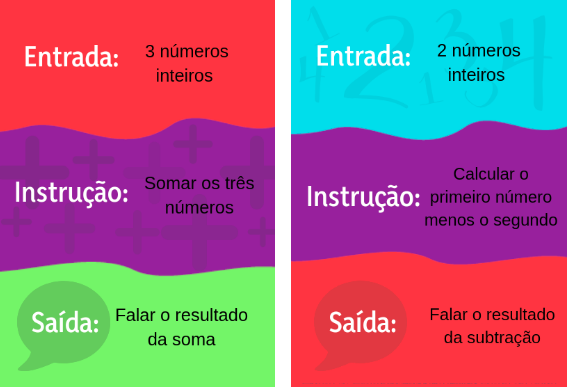
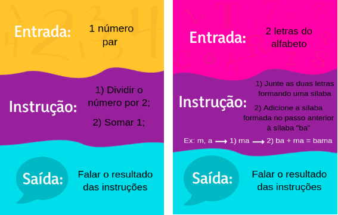
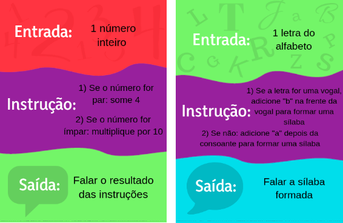

# Jogo "Adivinhe a Instrução!"

## Sobre
Esse jogo foi criado com o objetivo principal de trabalhar o conceito de entradas, saídas e do fluxo da informação. O objetivo dos alunos é adivinhar a instrução de uma carta, fornecendo entradas e ouvindo as saídas.

## Cartas

As cartas são compostas por três momentos: Entrada, Instrução e Saída. 
- A entrada enuncia o tipo de dado que é necessário para realizar a instrução. 
- A instrução define qual será a ação que o jogador deverá executar quando receber as entradas. 
- A saída é a ação que o jogador deverá realizar com o resultado da instrução.

## Dinâmica
À cada rodada, um jogador escolhe uma carta e o objetivo dos outros jogadores é adivinhar qual a instrução da carta escolhida. O jogador em posse da carta será chamado de *jogador computador* e os outros jogadores serão chamados de *jogadores usuários*. 

Depois que o jogador computador escolhe a carta, ele deve avisar para os usuários qual o *tipo da entrada* que ele necessita para realizar a instrução. Ex: “Dois números inteiros!” 

**Ciclo Principal**

 Os jogadores usuários, então, fornecem as entradas necessárias.
- Caso eles tenham fornecido entradas do tipo incorreto, o jogador computador deverá dizer que não foi possível realizar a instrução e repetir o tipo da entrada necessária.

- Caso os jogadores usuários tenham fornecido as entradas do tipo correto, o jogador computador deverá calcular o resultado da instrução com as entradas fornecidas e realizar a ação de saída – normalmente, dizer aos jogadores usuários o resultado da instrução. 

Os jogadores usuários, então, devem tentar adivinhar qual foi a instrução realizada. Caso não seja possível com apenas um exemplo, os jogadores usuários podem testar novas entradas, começando o ciclo principal novamente, até conseguirem descobrir qual a instrução comum a todos estes exemplos. 

**Ao acertar a instrução**

Quando os jogadores usuários acertam a instrução ou caso haja o esgotamento do limitante de tempo estabelecido pelo professor, escolhe-se outro jogador para ser o jogador computador e o antigo jogador computador passa a ser jogador usuário. O novo jogador computador escolhe uma carta e começa-se outra rodada. No caso de o tempo ter acabado, a carta é devolvida ao bolo das cartas em jogo e pode ser utilizada novamente. Quando acabarem as cartas do nível 1, passa-se ao nível 2 e, depois, ao nível 3. 

## Pontuação 

Caso os jogadores usuários acertem a instrução, cada usuário ganha 1 ponto e o jogador computador ganha 2 pontos. Para que esta pontuação funcione de maneira ideal, deve-se escolher sempre o número de cartas por nível como um múltiplo do número de jogadores. 

Exemplo: Caso hajam 3 jogadores, o nível 1 deve ser jogado com 3 ou 6 cartas. O mesmo se aplica para o nível 2 e nível 3, de forma que todos consigam ser usuários e computadores o mesmo número de vezes. 

## Níveis de Dificuldade

O jogo possui três níveis de dificuldade, diferenciados pela cor do verso da carta. 

- Nível Verde

As instruções deste nível são apenas operações aritméticas e lógicas básicas. Este nível é o mais simples, criado para facilitar a introdução das crianças ao próprio jogo e fixar o fluxo de informação entre entrada, instrução e saída. 

- Nível Roxo

 No nível roxo, a instrução é composta por dois passos sequenciais. Este nível foi criado com o objetivo de introduzir o sequenciamento de passos lógicos na programação, que mais tarde será chamado de algoritmo.

- Nível Vermelho

Neste nível, as instruções contêm estruturas condicionais. É o nível mais desafiador e busca sensibilizar os e para o uso de condicionais na programação. 

Para finalizar a dinâmica, o professor pode fazer um paralelo sobre a dinâmica dos sensores e atuadores, evidenciando que os atuadores realizam determinadas ações dependendo da leitura dos sensores. 

## Design das cartas
O desenho das cartas foi apenas um esboço criado para sua primeira utilização em sala de aula e consiste apenas em uma sugestão de design, passível de ser aprimorado pela equipe.

Busquei dividir as cartas em três momentos bem definidos para facilitar o entendimento e acompanhamento das crianças. Assim, cada momento (entrada, instrução e saída) tem um contorno bem definido e uma cor específica.
