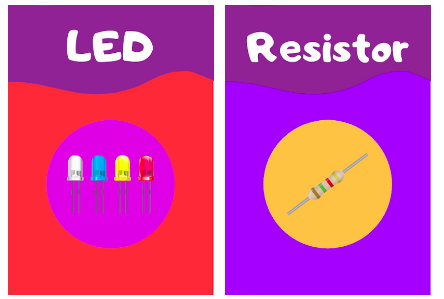

# Jogo das Palavras

## Sobre

## Cartas
Cada carta é composta pela palavra que deve ser adivinhada e pela imagem que a representa. 

## Dinâmica do Jogo

A turma é dividida em dois grupos. Começa-se pelo grupo que tem o estudante mais novo (podem existir várias maneiras de se escolher como começar!).
Este aluno sorteia uma carta e têm como objetivo fazer seu time adivinhar a palavra principal daquela carta em 40 segundos, descrevendo-a. 

## Pontuação 
Caso o time consiga adivinhar a carta, ele pontua da seguinte forma: 
 - 2 pontos pela carta adivinhada
-  1 ponto extra caso tenham conseguido adivinhar antes da metade do tempo (no caso de 40s, os alunos ganhariam o ponto extra caso conseguissem adivinhar em menos de 20s)

A carta adivinhada é guardada no bolo das cartas usadas e o time passa a vez. 

Caso o time não consiga adivinhar a carta, o jogador mostra a palavra que havia tentado descrever, coloca no bolo de cartas usadas e o time passa a vez. 

## Variações 

### Limitante de tempo
O tempo de 40s foi apenas uma das possíveis escolhas - os professores e alunos podem combinar entre si! Mas uma sugestão pessoal para este jogo é escolher um limite que se considere *desafiador*. 

### 1 carta x Várias cartas
Ao invés de se delimitar o tempo para adivinhar 1 carta, pode-se jogar pontuando o número de cartas adivinhadas por rodada. Por exemplo, limita-se um tempo de 1 minuto e o time tem até o cronômetro apitar para adivinhar o maior número de cartas possíveis, uma de cada vez. 

Exemplo: O estudante sorteia uma carta, formula a frase e o time adivinha. O time ganha um ponto. O mesmo estudante então sorteia outra carta e tenta novamente fazer o time adivinhar. O time adivinha a segunda carta e ganha mais um ponto. O mesmo estudante sorteia outra carta e assim por diante, até o cronômetro apitar. 

Neste modo, os estudantes pontuam por carta adivinhada e não há pontos extras por limite de tempo. Caso o time tenha conseguido adivinhar 5 cartas em 1 minuto, eles ganham 5 pontos. 

