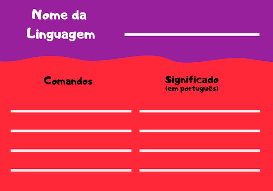

# Jogo do Compilador

## Sobre 
O objetivo deste jogo é introduzir os conceitos de linguagem de programação e compilador para os alunos, facilitando a sua abstração acerca da utilização de comandos e seus significados. Os alunos devem criar a própria linguagem composta por 4 comandos: para frente, para trás, para esquerda e para direita. Depois, devem utilizá-la para mover o peão (ou jogador) no tabuleiro e atingir a linha de chegada! 

## Cartas
As cartas do Jogo do Compilador foram criadas para serem preenchidas pelas crianças. Ela é dividida em três momentos: “Nome da Linguagem”, “Comandos” e “Significado”.

## Dinâmica em Sala
Este jogo precisa de um tabuleiro e se joga em equipes! Neste caso, podemos:
- trazer um tabuleiro pré-definido e peões para os alunos utilizarem;
- pedir para os alunos desenharem o próprio tabuleiro em um pedaço de papel, e utilizar marcadores para se movimentar;
- formar um tabuleiro no chão da sala (foto a seguir), com estes pequenos quadrados ou com as próprias linhas do chão e, neste caso, os alunos são os próprios peões. Pode-se, também, utilizar as cadeiras como obstáculos no percurso. 

Depois de montado o tabuleiro, divide-se a turma em equipes e pedimos a cada equipe para definir sua linguagem e dar um nome a ela. As linguagens criadas devem conter 4 comandos específicos que utilizaremos para controlar os peões no labirinto, são eles:
- “Vá para frente”
- “Vá para trás”
- “Vá para esquerda”
- “Vá para direita”. 

Exemplo: Linguagem Elementos: fogo = frente, água = trás, ar = direita, terra = esquerda. 

Depois, pede-se a cada equipe para escolher dois integrantes: um para ser o peão e outro para ser o compilador. Os demais serão os programadores. 

O jogo funciona assim: 
- O objetivo de cada equipe é que o peão atinja um local indicado no tabuleiro. 
- De turnos em turnos, os programadores rodam o dado, ganham a energia que foi tirada, e conseguem mover o peão tantos passos no tabuleiro quanto tirados no dado.
- Mas os programadores só falam na língua criada, e o peão só fala português!
- O compilador então terá o objetivo de traduzir os comandos gerados pela equipe para o peão, de forma que ele possa se mover no tabuleiro. 
- O peão sempre se move de acordo com o que o compilador falar, independente se ele acertar ou errar!

Exemplo: a equipe 1, que criou a linguagem elementos, tira 3 nos dados. A equipe quer que o peão vá para frente, depois vá para direita, depois vá para frente. Desta forma, a equipe fala “fogo, ar, fogo” para o compilador e o compilador traduz “frente, direita, frente” para o peão. O peão, então, se movimenta no labirinto. 

Quando um dos peões atingir a chegada, ele deve cumprir um desafio proposto pelo professor. Caso não consiga, fica travado na casa de chegada e deve esperar novamente a vez da equipe para tentar cumprir outro desafio. Caso consiga, garante um ponto à sua equipe, volta para a mesa e a equipe seleciona outro jogador para ser peão e outro jogador para ser compilador. Este novo jogador vai para o ponto de início do tabuleiro e começa-se o ciclo novamente. 

A equipe que conseguir completar o labirinto com todos os integrantes sendo peões, vence! 
